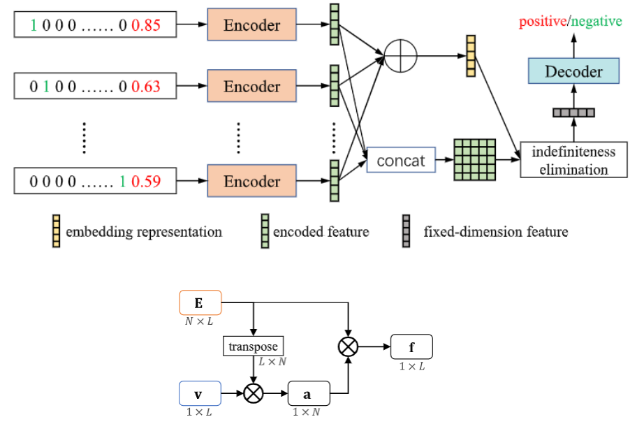

## IE-Net

**针对目前不同患者检测项目数存在差异，作者设计了一种不基于固定检测项目的网络。对每一种检测项目编码，通过矩阵运算转换，每一位患者的检测项目转换为统一维度的向量，再统一解码。训练网络时，因为每位患者检测项目不同，所以一次传入1位患者的数据(batch size=1)，换句话说，以往我们训练网络的时候batch size是每次训练网络的数据个数，而在这里，指的是每一位患者的检测项目，batch size不表示多少位患者了。**

**源代码链接**：[gyguo/IE-Net: official code of "Eliminating Indefiniteness of Clinical Spectrum for Better Screening COVID-19", accepted by IEEE Journal of Biomedical and Health Informatics (JBHI2021). (github.com)](https://github.com/gyguo/IE-Net)

**论文链接**：[Eliminating Indefiniteness of Clinical Spectrum for Better Screening COVID-19 | IEEE Journals & Magazine | IEEE Xplore](https://ieeexplore.ieee.org/document/9357911)

**网络结构**：



网络代码：

```python
import torch
import torch.nn as nn


class IENet(nn.Module):
    def __init__(self, cfg):
        super(IENet, self).__init__()
        self.softmax = nn.Softmax(dim=0)
        self.sigmoid = nn.Sigmoid()
        self.fc_feat1 = nn.Linear(in_features=cfg.NETWORK.DATA_DIM, out_features=cfg.NETWORK.FEATURE_DIM)
        self.fc_feat2 = nn.Linear(in_features=cfg.NETWORK.FEATURE_DIM, out_features=cfg.NETWORK.FEATURE_DIM)
        self.fc_cls1 = nn.Linear(in_features=cfg.NETWORK.FEATURE_DIM, out_features=cfg.NETWORK.FEATURE_DIM)
        self.fc_cls2 = nn.Linear(in_features=cfg.NETWORK.FEATURE_DIM, out_features=cfg.NETWORK.PRED_DIM)
        # self.embedding_vector = nn.Parameter(torch.randn((cfg.NETWORK.FEATURE_DIM, 1))).float().cuda()
        self.dropout = nn.Dropout(p=cfg.NETWORK.DROPOUT)
        self.lrelu = nn.LeakyReLU()
        
    def forward(self, x):
        feature1 = self.lrelu(self.fc_feat1(x))  # [N, D]
        feature = self.fc_feat2(feature1)
        # unsqueeze
        feature_uns = torch.unsqueeze(feature, dim=0)
        # embedding = torch.unsqueeze(self.embedding_vector, dim=0)
        embedding = torch.sum(feature_uns, dim=1)
        embedding = torch.unsqueeze(embedding, dim=2)
        weight = torch.matmul(feature_uns, embedding)  # [1, N, 1]
        weight = torch.squeeze(weight, dim=0)  # [N, 1]
        # weight_norm = self.softmax(weight)

        feature_wei = feature * weight  # [N, D]
        feature_agg = torch.sum(feature_wei, dim=0, keepdim=True)  # [1, D]
        feature_cls = self.lrelu(self.fc_cls1(feature_agg))
        # dropout
        feature_per = self.dropout(feature_cls)

        score = self.fc_cls2(feature_per)  # [1, 1]
        score = torch.squeeze(score, dim=0)
        score = self.sigmoid(score)  # we calculate BCEloss, thus use Sigmoid activation
        return score
        
        
if __name__ == '__main__':
    import sys
    sys.path.insert(0, '../../lib')
    from config.default import config as cfg
    from config.default import update_config

    cfg_file = '../../experiments/IENet.yaml'
    update_config(cfg_file)

    data = torch.randn((10, 97)).cuda()
    network = IENet(cfg).cuda()

    score = network(data)
    print(score.size(), score)
```

