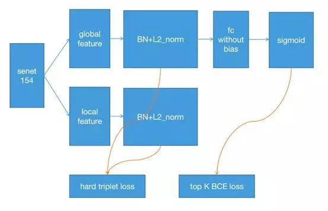

## 问题：

1、小样本学习

2、细粒度分类

## 难点：

1、样本严重不均衡

2、大量无标注数据

## 前期尝试：

soft+固定阈值，效果不好

## 后期改进：

1、SE-resneXt154作为backbone，对每一类做二分类(eg:某个鲸鱼id是w1，二分类就是是不是w1)，triplet loss来做特征度量，4 fold cross validation

2、鲸鱼尾部不对称，不妨将其翻转，用作新的类别

3、伪标签，在模型预测准确率很高后，将预测置信度为1的测试样本加入到训练集中

## 参考资料

[Humpback Whale Identification | Kaggle](https://www.kaggle.com/c/humpback-whale-identification/discussion/82366)

