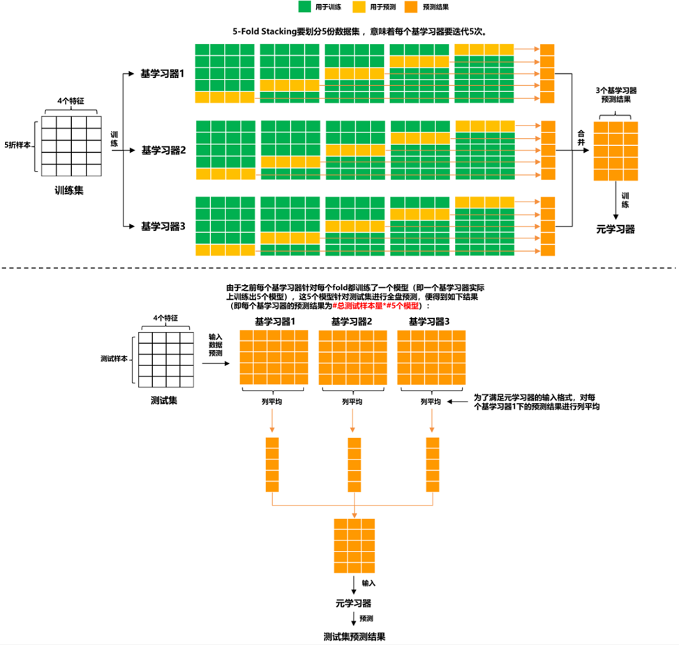
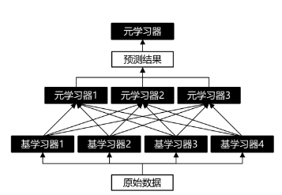
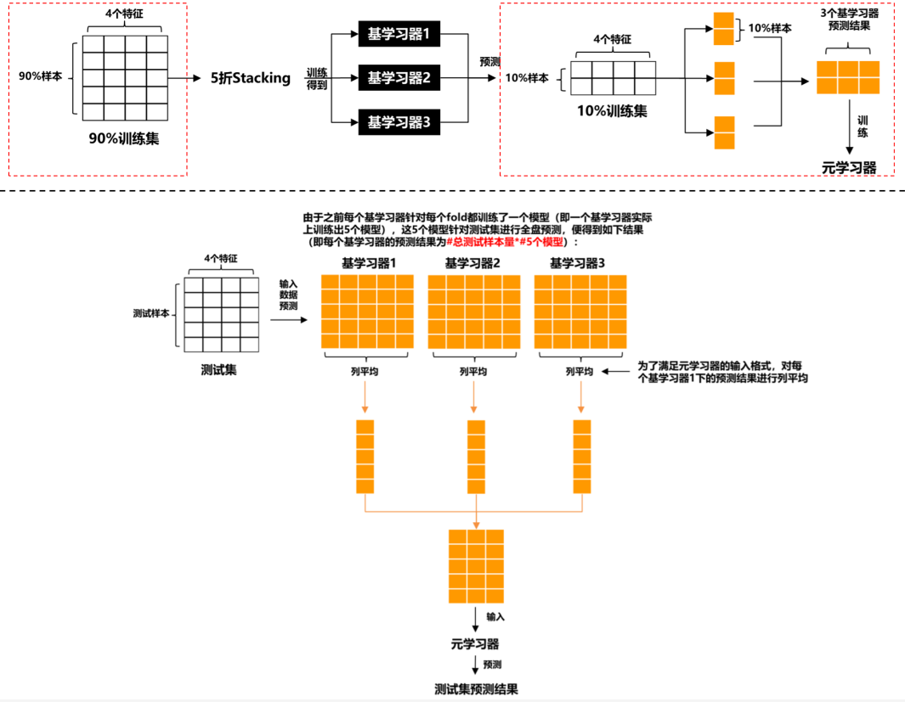

## 模型融合

[toc]

### 融合对象

- **不同训练数据**：数据集使用比例、预处理方法 (缺失值填补、特征工程等)
- **不同模型结构**：RF、XGBoost、LightGBM、CatBoost、CNN、LSTM等;
- **不同超参**：随机种子数、权重初始化、收敛相关参数 (例如学习率、batch size、epoch、早停步数)、损失函数、子采样比例等。

### 融合方法

#### 投票法

普通投票和加权投票。为了降低模型之间的相关性，可以对所有模型预测出的结果计算**Pearson系数**，最后选取其中相关性小的模型结果进行投票。
#### 平均法

对多个学习器的预测结果(回归或分类中的概率)进行平均。算数平均，几何平均，加权平均。

#### 排序法

如果模型评估标准是与排序或者阈值相关(例如**AUC**)，简单使用平均法并不见得都能取得较好得结果，因为波动小的模型做融合，对最终结果造成的影响不大。在赛圈，碰到AUC，很多都会采用这种方法进行模型融合。比如在招商银行的 “消费金融场景下的用户购买预测” 的冠军方案中 [3] 便针对赛题方的AUC评分标准，采用了基于排序的模型融合方法。排序法的具体步骤如下：

(1) 对预测结果进行**排序**；

(2) 对排序序号进行**平均**；

(3) 对平均排序序号进行**归一化**。

#### Stacking

Stacking堆叠法是相对比较高级的模型融合法，也是本文的重点。Stacking的思路是基于原始数据，训练出多个基学习器，然后将基学习器的预测结果组合成新的训练集，去训练一个新的学习器。

Stacking主要分为以下三类：

- 单层Stacking

- 多层Stacking

- 其它技术与Stacking的结合

单层Stacking

除此之外，Stacking在特征上也可以玩出一些花样，其中，[1] 便介绍了两种单层Stacking上的特征交互方法：

- **Feature-weighted Linear Stacking (FWLS)**：Still等人在论文 [5] 中提出了该方法。基学习器们的预测结果叫元特征，因为它们是用于训练元学习器。FWLS提出可以在元学习器前，对元特征进行特征交互，交互对象可以是元特征本身，也可以是原始特征（即：**元特征\*元特征** 或 **元特征\*原始特征**）。
- **Quadratic Linear Stacking of Models**：它采用的特征交互模式是：元特征*元特征+元特征*原始特征。

多层Stacking

其它技术与Stacking的结合

Stacking可以与无监督学习方法结合。例如：使用**t-SNE**将数据降维到2或3维，然后用非线性元学习器来融合。

#### Blending

对原始数据集先划分出一个较小的留出集，比如10%训练集被当做留出集，那么**Blending用90%的数据做基学习器的训练，而10%留出集用作训练元学习器**，这样基学习器和元学习是用不同数据集来训练的。

### 参考资料

https://mp.weixin.qq.com/s/-MbiSkgkF11gt5t9W0ExTw
